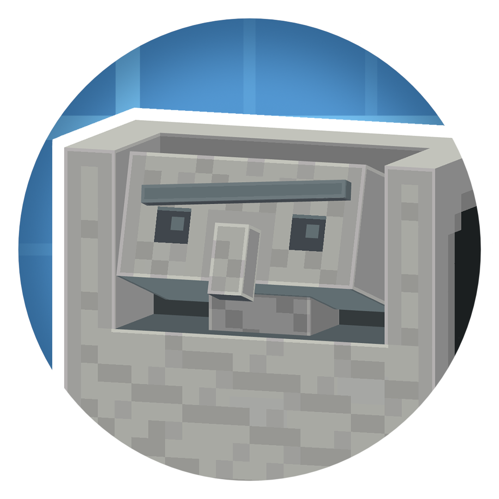

<h1 align="center">Create: Biomechanical   
	
	
	
	
    
      
</h1>

Harness the fusion of machinery and life with Create: Biomechanical. Build and bring to life the Cogolem—a mechanical golem that serves various functions depending on its mode. Use the Cogolem Station to power up your Cogolem, enhance its abilities, and switch between modes to suit your needs. Whether you need a helper for transportation, construction, or defense, the Cogolem is an adaptable ally ready to work by your side.

Future updates will expand functionality with new golems, station upgrades, and more biomechanical creations to revolutionize your Create mod experience!

<h1></h1>
<h4 align="center">Find out more about Create: Biomechanical on our <a href="https://www.curseforge.com/minecraft/mc-mods/create-biomechanical">Curseforge</a> or <a href="https://modrinth.com/project/create-biomechanical">Modrinth</a> Page</h4>
